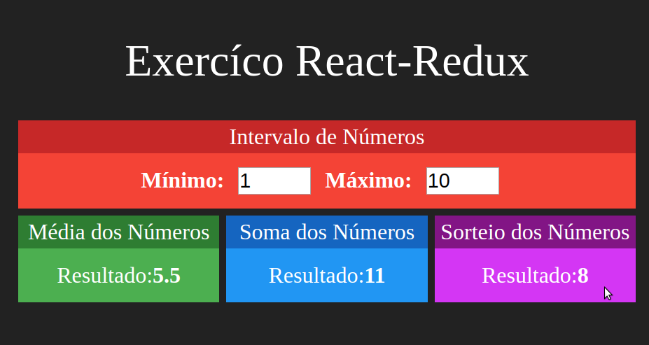

<h1>Redux Basics</h1>

Link Útil: <a>https://redux.js.org/</a>

Repositório destinado ao estudo de conceitos básicos do Redux. O conteúdo do repositório foi gerado a partir de curso online.

<h3> Exercício Central</h3>

Para entender o funcionamento do Redux e da integração entre esse framework
    e o React foi feito um projeto simples capaz de representar as diferenças 
    quando se utiliza o Redux e quando não o tuilizamos. Na primeira parte foi feito 
    um app web simples em React capaz de fornecer a partir de dois números a sua soma, média e 
    um valor entre eles. O redux  apesar de não ser necessário para o tamanho do projeto,
     foi justificado para fins de aprendizado. O redux produz um store cujas ações vão ser jogadas nos reducers e estes por sua vez 
     serão disparados conforme os eventos se manifestem.

Uma imagem do app pode ser vista abaixo.

<h3>Algumas instruções...</h3>

<b>1-Instalação:</b>

<code>npm install redux</code>

<b>Criando React Redux App</b>

<code>npx create-react-app my-app --template redux</code>

<b>Exemplos de projetos no link abaixo</b>

<a href="https://redux.js.org/introduction/examples">https://redux.js.org/introduction/examples</a>
